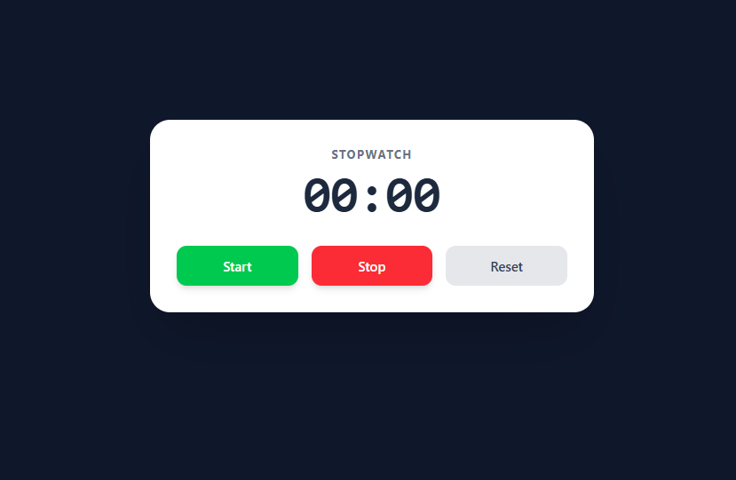

# ⏱️ React Stopwatch

A sleek, modern, and efficient Stopwatch application built with **React** and styled using **Tailwind CSS**.


*(Note: Upload a screenshot of your app to your repo and name it `screenshot.png` to see it here!)*

## 🚀 Features

* **Start, Stop, & Reset:** Full control over the timer state.
* **Accurate Timing:** Uses `useRef` to manage intervals without re-rendering issues.
* **Formatted Display:** Automatically formats time into a clean `MM:SS` digital clock style.
* **Responsive UI:** Fully responsive design that looks great on all devices.
* **Interactive Controls:** Buttons feature hover states and "press" animations for a tactile feel.

## 🛠️ Tech Stack

* **[React](https://reactjs.org/)** - For building the component-based UI and managing state.
* **[Tailwind CSS](https://tailwindcss.com/)** - For rapid, utility-first styling.
* **JavaScript (ES6+)** - Logic for time calculation and formatting.

## ⚙️ How It Works (Under the Hood)

This project solves common React timer pitfalls by using a combination of hooks:
* **`useState`**: Handles the visual update of the time on screen.
* **`useRef`**: Stores the active Interval ID behind the scenes so the timer persists between renders without causing "stale closure" bugs.
* **Functional State Updates**: Uses `setTime(prev => prev + 1)` to ensure the timer never gets stuck at 1 second.

## 📦 Getting Started

Follow these steps to run the project locally on your machine.

### Prerequisites

* Node.js installed (v14 or higher recommended)
* npm or yarn

### Installation

1.  **Clone the repository**
    ```bash
    git clone [https://github.com/aryan-main027/Stop-Watch.git](https://github.com/aryan-main027/Stop-Watch.git)
    cd Stop-Watch
    ```

2.  **Install dependencies**
    ```bash
    npm install
    ```

3.  **Start the development server**
    ```bash
    npm run dev
    # or if you are using Create React App:
    # npm start
    ```

4.  **Open in Browser**
    Visit `http://localhost:5173` (Vite) or `http://localhost:3000` (CRA) to view the app.

## 🤝 Contributing

Contributions are welcome! If you have ideas for features (like adding Laps or Milliseconds), feel free to fork the repo and submit a pull request.

1.  Fork the Project
2.  Create your Feature Branch (`git checkout -b feature/AmazingFeature`)
3.  Commit your Changes (`git commit -m 'Add some AmazingFeature'`)
4.  Push to the Branch (`git push origin feature/AmazingFeature`)
5.  Open a Pull Request

## 📄 License

Distributed under the MIT License. See `LICENSE` for more information.

---

Made with ❤️ by [Aryan](https://github.com/aryan-main027)
